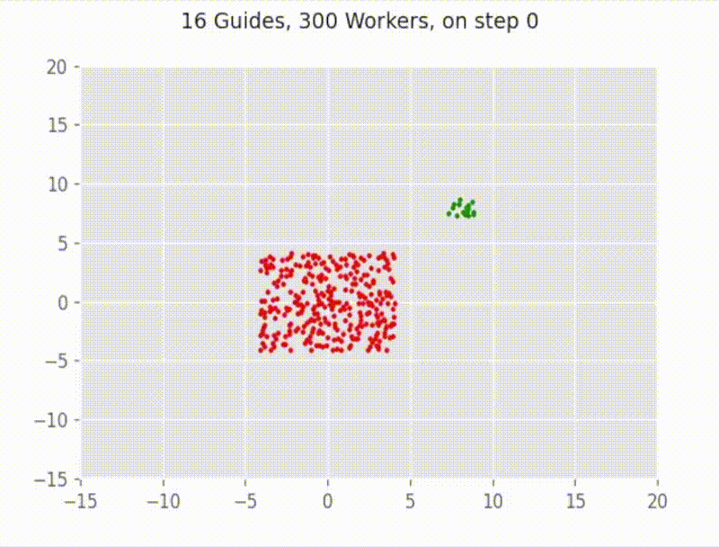
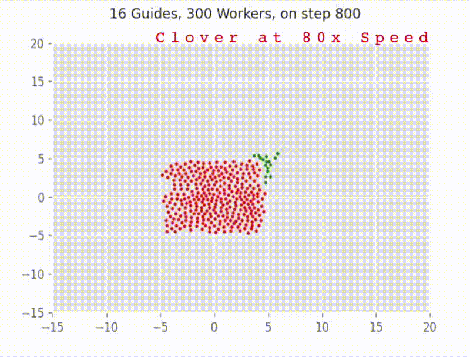
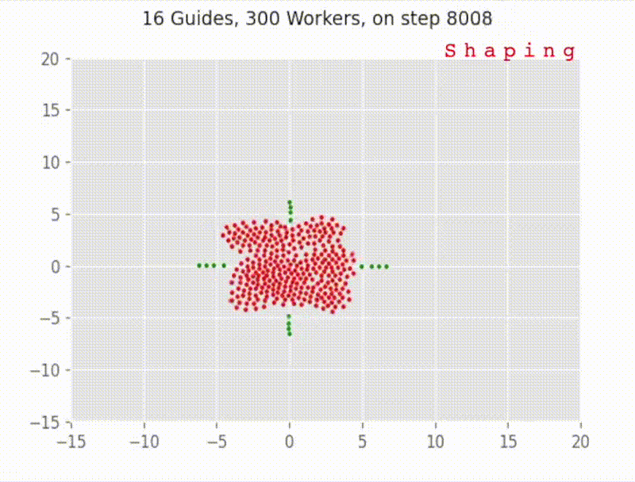
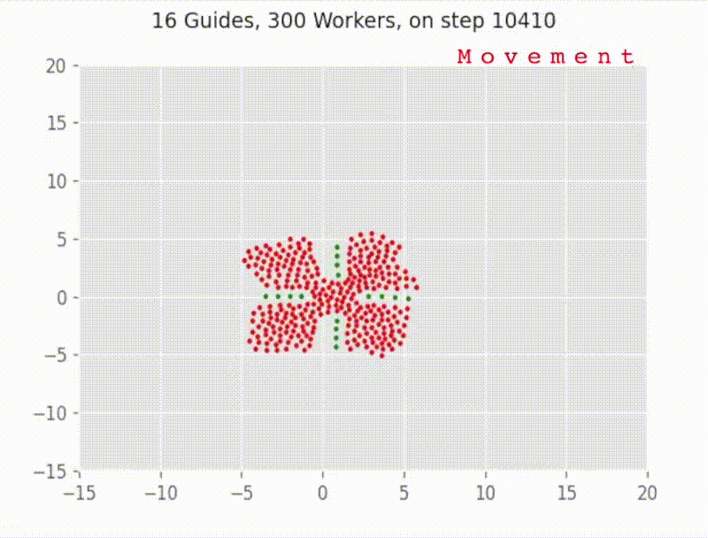
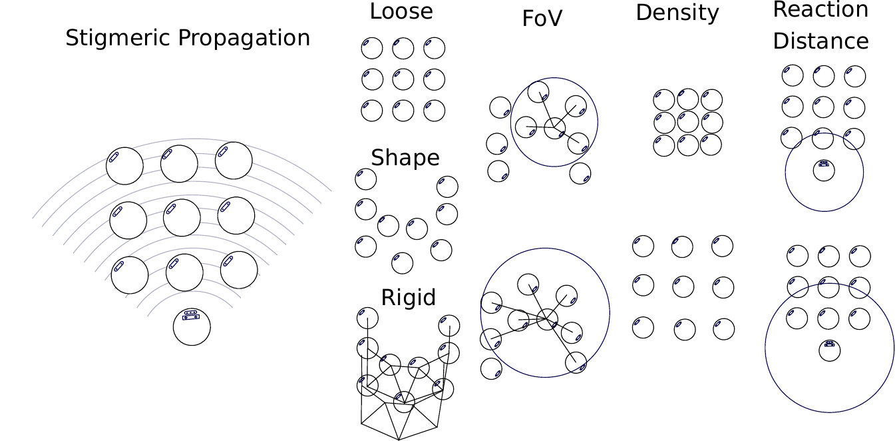
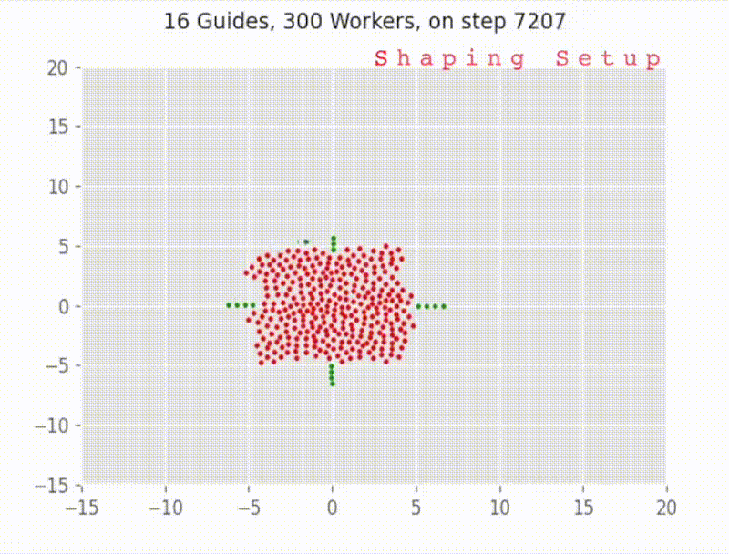

# Particle_Swarm
This is the official code repository for the project Particle Swarm.
The major portion of this repository contains the code for our simulation experiments, and we also provide links to the hardware code repository.

# Citation
When using the code from this repository, consider citing the associated paper: 

```
@article{varadharajan2022hierarchical,
  title={Hierarchical control of smart particle swarms},
  author={Varadharajan, Vivek Shankar and Dyanatkar, Sepand and Beltrame, Giovanni},
  journal={arXiv preprint arXiv:2204.07195},
  year={2022}
}
```

# Brief Approach 
We propose a method for the control of robot swarms using two subsets of robots: a large group of simple, oblivious robots (which we call the workers) that is governed by simple local attraction forces, and a smaller group (the guides) with sufficient mission knowledge to create and displace a desired worker formation by operating on the local forces of the workers. The guides coordinate to shape the workers like smart particles by changing their interaction parameters.
 

# States in Guide Swarm 
<table>
  <tr>
    <td><font size="5">Separation</td>
    <td><font size="5">Edge Following</td>
    <td><font size="5">Shaping Setup</td>
  </tr>
  <tr>
    <td></td>
    <td></td>
    <td></td>
  </tr>
 </table>
<table>
  <tr>
    <td><font size="5">Shaping</td>
     <td><font size="5">Movement</td>
  </tr>
  <tr>
    <td></td>
    <td></td>
  </tr>
 </table>

# Control Parameters of Worker Swarm

<table>
  <tr>
    <td><font size="5">Control Parameters</td>
    <td><font size="5">Configuring Density</td>
  </tr>
  <tr>
    <td></td>
    <td></td>
  </tr>
</table>

# Robot Behavior scripts
Robot behavior scripts were developed with [Buzz](https://the.swarming.buzz/) (an extensible programming language for robot swarms). Buzz provides many primitives for programming robot behaviors. We use some of these primitives, like virtual stigmergy, to propagate control parameters across the workers.
The simulation experiments were performed using the [ARGoS3](https://github.com/ilpincy/argos3) simulator (including the simulations corresponding to the moving plots above) and the [Khepera-IV plugin](https://github.com/ilpincy/argos3-kheperaiv) for ARGoS3.

# Repository organization 
```
+-- README.md
+-- Images (Images used in readme)
+-- Simulation (Simulation Experiment scripts)
|   +-- Convergence_experiments (Convergence of Worker control parameters experiments, fig.5)
|       +-- batch_scripts (scripts used for batch experimental runs on HPC clusters)
|       +-- buzz_script (buzz script used for the convergence experiment)
|       +-- Data_analysis (Notebooks used for data processing and plot generation)
|       +-- experiments (argos experiment files used for the experiment)
|       +-- loop_function (argos loop function used for experiment configuration and data logging)
|   +-- Movement_experiments (Shape formation and movement experimental files)
|       +-- batch_scripts (scripts used for batch experimental runs on HPC clusters)
|           +-- launch_job.sh (script to create jobs for the whole experimental set to be run on HPC)
|           +-- run_job.sh (script to run a single configuration)
|       +-- buzz_scripts (scripts used for the movement experiments)
|           +-- Object_movement_test.bzz (Unified script containing the robot behavior for both guides and workers)
|       +-- data_processing (Notebooks used for data processing and plot generation)
|       +-- experiments (experimental argos files and simulation configuration)
|           +-- template.argos (template argos file used by batch script like run_job.sh)
|           +-- template_exp.argos (an experimental instance that can run locally, use this to start the experiment)
|       +-- loop_funcs (argos loop function used for experiment configuration, robot placement and data logging)
|       +-- algorithmPseudocode.txt (Contains the pseudo code of the overall behavior)
|       +-- edge_following.txt (Contains the pseudo code of the edge following behavior)
```
The following instructions assume the user is running a Debian OS (e.g. Ubuntu). 
The repository was tested on Ubuntu 20

## Dependencies 
ARGoS3 (Multi-robot simulator)
KheperaIV plugin for ARGoS3
Buzz (Programming language for Robot swarms)

Follow the following steps to setup the dependencies.

TODO

## Testing 

The following launches an instance of the particle swarm experiment.
One could change the configuration in the loop function tab of the template_exp.argos to change the experimental configuration.

```
cd experiments
argos3 -c template_exp.argos
```
